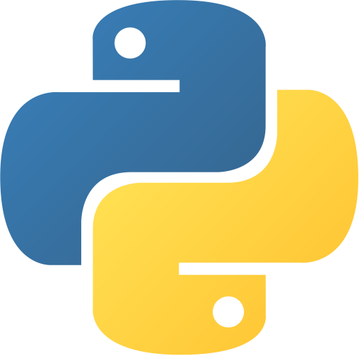

# design-patterns

<!-- Improved compatibility of back to top link: See: https://github.com/othneildrew/Best-README-Template/pull/73 -->

<a name="readme-top"></a>

<!-- PROJECT SHIELDS -->
<!--
*** Markdown "reference style" links for readability.
*** Reference links are enclosed in brackets [ ] instead of parentheses ( ).
-->

<!-- PROJECT LOGO -->
<br />
<div align="center">
  <a href="https://github.com/othneildrew/Best-README-Template">
    
  </a>

<h3 align="center">design-patterns</h3>

  <p align="center">
    Design patterns in Python
    <br />
    <a href="https://github.com/jpcadena/design-patterns"><strong>Explore the docs »</strong></a>
    <br />
  </p>
</div>

<!-- TABLE OF CONTENTS -->
<details>
  <summary>Table of Contents</summary>
  <ol>
    <li>
      <a href="#about-the-project">About The Project</a>
      <ul>
        <li><a href="#built-with">Built With</a></li>
      </ul>
    </li>
    <li>
      <a href="#getting-started">Getting Started</a>
      <ul>
        <li><a href="#prerequisites">Prerequisites</a></li>
        <li><a href="#installation">Installation</a></li>
      </ul>
    </li>
    <li><a href="#usage">Usage</a></li>
    <li><a href="#contributing">Contributing</a></li>
    <li><a href="#license">License</a></li>
    <li><a href="#contact">Contact</a></li>
  </ol>
</details>

<!-- ABOUT THE PROJECT -->

## About the project

[![Project][project-screenshot]](https://example.com)

This project is about Design Patterns in Python that includes the S.O.L.I.D.
principles and the Gamma Categorization for 23 design patterns classified into
Creational, Behavioral and Structural based on Clean Code: A Handbook of Agile
Software Craftsmanship by Robert C. Martin.

<p align="right">(<a href="#readme-top">back to top</a>)</p>

## Built with

[![Python][python-shield]][python-url] [![isort][isort-shield]][isort-url] [![Black][black-shield]][black-url] [![Ruff][ruff-shield]][ruff-url] [![MyPy][mypy-shield]][mypy-url] [![pre-commit][pre-commit-shield]][pre-commit-url] [![GitHub Actions][github-actions-shield]][github-actions-url] [![Poetry][poetry-shield]][poetry-url] [![Pycharm][pycharm-shield]][pycharm-url] [![Visual Studio Code][visual-studio-code-shield]][visual-studio-code-url] [![Markdown][markdown-shield]][markdown-url] [![License: MIT][license-shield]][license-url]

<p align="right">(<a href="#readme-top">back to top</a>)</p>

<!-- GETTING STARTED -->

## Getting started

### Prerequisites

- [Python 3.11][python-docs]

### Installation

1. Clone the **repository**
   ```
   git clone https://github.com/jpcadena/design-patterns.git
   ```
2. Change the directory to **root project**
   ```
   cd design-patterns
   ```
3. Install **Poetry** package manager
   ```
   pip install poetry
   ```
4. Install the project's **dependencies**
   ```
   poetry install
   ```
5. Activate the **environment**
   ```
   poetry shell
   ```

<p align="right">(<a href="#readme-top">back to top</a>)</p>

<!-- USAGE EXAMPLES -->

### Usage

1. Execute with console
   ```
   python main.py
   ```

<p align="right">(<a href="#readme-top">back to top</a>)</p>

<!-- CONTRIBUTING -->

## Contributing

[![GitHub][github-shield]][github-url]

If you have a suggestion that would make this better, please fork the repo and
create a pull request.

1. Fork the Project
2. Create your Feature Branch (`git checkout -b feature/AmazingFeature`)
3. Commit your Changes (`git commit -m 'Add some AmazingFeature'`)
4. Push to the Branch (`git push origin feature/AmazingFeature`)
5. Open a Pull Request

Use docstrings with **reStructuredText** format by adding triple double quotes
**"""** after function definition.\
Add a brief function description, also for the parameters including the return
value and its corresponding data type.\
Please use **linting** to check your code quality
following [PEP 8](https://peps.python.org/pep-0008/).\
Check documentation
for [Visual Studio Code](https://code.visualstudio.com/docs/python/linting#_run-linting)
or [Jetbrains Pycharm](https://github.com/leinardi/pylint-pycharm/blob/master/README.md).\
Recommended plugin for
autocompletion: [Tabnine](https://www.tabnine.com/install)

<p align="right">(<a href="#readme-top">back to top</a>)</p>

<!-- LICENSE -->

## License

Distributed under the MIT License. See [LICENSE](LICENSE) for more information.

<p align="right">(<a href="#readme-top">back to top</a>)</p>

<!-- CONTACT -->

## Contact

- [![LinkedIn][linkedin-shield]][linkedin-url]

- [![Outlook][outlook-shield]](mailto:jpcadena@espol.edu.ec?subject=[GitHub]design-patterns)

<p align="right">(<a href="#readme-top">back to top</a>)</p>

<!-- MARKDOWN LINKS & IMAGES -->
<!-- https://www.markdownguide.org/basic-syntax/#reference-style-links -->

[project-screenshot]: assets/images/project.png

[python-docs]: https://docs.python.org/3.11/

[//]: # "Shields"

[linkedin-shield]: https://img.shields.io/badge/linkedin-%230077B5.svg?style=for-the-badge&logo=linkedin&logoColor=white

[outlook-shield]: https://img.shields.io/badge/Microsoft_Outlook-0078D4?style=for-the-badge&logo=microsoft-outlook&logoColor=white

[python-shield]: https://img.shields.io/badge/python-3670A0?style=for-the-badge&logo=python&logoColor=ffdd54

[pycharm-shield]: https://img.shields.io/badge/PyCharm-21D789?style=for-the-badge&logo=pycharm&logoColor=white

[markdown-shield]: https://img.shields.io/badge/Markdown-000000?style=for-the-badge&logo=markdown&logoColor=white

[github-shield]: https://img.shields.io/badge/github-%23121011.svg?style=for-the-badge&logo=github&logoColor=white

[ruff-shield]: https://img.shields.io/endpoint?url=https://raw.githubusercontent.com/charliermarsh/ruff/main/assets/badge/v1.json

[black-shield]: https://img.shields.io/badge/code%20style-black-000000.svg?style=for-the-badge&logo=appveyor

[mypy-shield]: https://img.shields.io/badge/mypy-checked-2A6DB2.svg?style=for-the-badge&logo=appveyor

[visual-studio-code-shield]: https://img.shields.io/badge/Visual_Studio_Code-007ACC?style=for-the-badge&logo=visual-studio-code&logoColor=white

[poetry-shield]: https://img.shields.io/endpoint?url=https://raw.githubusercontent.com/python-poetry/website/main/static/badge/v0.json

[isort-shield]: https://img.shields.io/badge/%20imports-isort-%231674b1?style=flat&labelColor=ef8336

[github-actions-shield]: https://img.shields.io/badge/github%20actions-%232671E5.svg?style=for-the-badge&logo=githubactions&logoColor=white

[pre-commit-shield]: https://img.shields.io/badge/pre--commit-F7B93E?style=for-the-badge&logo=pre-commit&logoColor=white

[license-shield]: https://img.shields.io/badge/License-MIT-yellow.svg

[github-shield]: https://img.shields.io/badge/github-%23121011.svg?style=for-the-badge&logo=github&logoColor=white

[//]: # "URL"

[linkedin-url]: https://linkedin.com/in/juanpablocadenaaguilar
[python-url]: https://www.python.org/

[pycharm-url]: https://www.jetbrains.com/pycharm/

[markdown-url]: https://daringfireball.net/projects/markdown/

[github-url]: https://github.com/jpcadena/design-patterns

[ruff-url]: https://beta.ruff.rs/docs/

[black-url]: https://github.com/psf/black

[mypy-url]: http://mypy-lang.org/

[visual-studio-code-url]: https://code.visualstudio.com/

[poetry-url]: https://python-poetry.org/

[isort-url]: https://pycqa.github.io/isort/

[github-actions-url]: https://github.com/features/actions

[pre-commit-url]: https://pre-commit.com/

[license-url]: https://opensource.org/licenses/MIT

[github-url]: https://github.com/jpcadena/design-patterns
